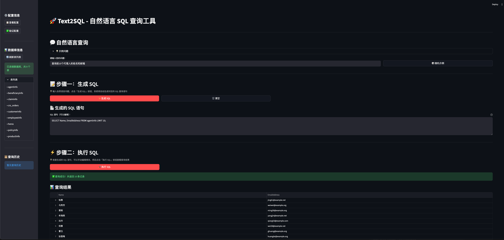

# Text2SQL - 基于 LangChain 的自助式数据报表开发

## 项目简介

本项目基于 LangChain 框架实现自然语言到 SQL 的转换，支持自助式数据报表开发。通过 SQL Copilot 和 LangChain SQL Agent，用户可以轻松使用自然语言查询数据库。

## 界面预览



*Web 界面截图：展示自然语言查询功能和查询结果*

## 功能特性

- 🤖 **LLM 模型支持**：优先支持阿里云模型（本地部署/API调用）
- 🔧 **FunctionCall 系统**：易于维护的工具函数架构
- 💡 **SQL Copilot**：交互式 SQL 辅助工具
- 🎯 **LangChain SQL Agent**：智能 SQL 查询代理
- 💾 **多数据源支持**：支持 MySQL 等多种数据库

## 快速开始

### 1. 安装依赖

```bash
pip install -r requirements.txt
```

### 2. 配置环境变量

**方式一：手动创建 `.env` 文件**

复制 `env.example` 文件并重命名为 `.env`，然后修改配置：

```bash
cp env.example .env
```

**方式二：使用配置脚本**

```bash
python config_env.py
```

`.env` 文件配置示例：

```env
# 数据库配置
DB_HOST=0.0.0.0
DB_PORT=3306
DB_USER=your_db_user
DB_PASSWORD=your_db_password
DB_NAME=life_insurance

# 阿里云百炼模型配置
# 请从阿里云控制台获取：https://dashscope.console.aliyun.com/apiKey
DASHSCOPE_API_KEY=sk-your-dashscope-api-key-here
MODEL_TYPE=api  # api 或 local
MODEL_NAME=qwen-turbo

# LLM 参数配置
LLM_TEMPERATURE=0.1
LLM_MAX_TOKENS=2000
```

> ⚠️ 注意：`.env` 文件包含敏感信息，已被 `.gitignore` 忽略，不会提交到版本库。

### 3. 初始化数据库

导入 Data 目录中的 SQL 文件到数据库：

```bash
# 自动导入（如果表已存在则跳过）
python data_loader/init_db.py

# 或者使用导入脚本
python data_loader/import_data.py

# 强制重新导入（会删除已存在的表）
python data_loader/init_db.py --force
```

脚本会自动：
- ✅ 检查表是否已存在
- ✅ 如果不存在则自动创建表并导入数据
- ✅ 如果已存在则跳过（除非使用 `--force` 参数）
- ✅ 显示详细的导入进度和统计信息

### 4. 启动应用

#### 方式一：Web 界面（推荐）

启动 Streamlit Web 应用：

```bash
# 使用脚本启动（推荐）
./启动Web应用.sh

# 或直接使用 streamlit 命令（必须使用 streamlit run）
streamlit run web_app.py

# ⚠️ 注意：不要直接运行 python web_app.py，必须使用 streamlit run 命令
```

浏览器会自动打开 `http://localhost:8501`

#### 方式二：命令行界面

```bash
python examples/copilot_cli.py
```

## 项目结构

```
LangChain/
├── config/          # 配置文件
├── core/            # 核心代码
├── utils/           # 工具函数
├── data_loader/     # 数据加载器
├── tests/           # 测试文件
├── examples/        # 示例代码
├── web_app.py       # Web 应用（Streamlit）
└── Checklist.md     # 开发清单
```

## 使用示例

```python
from core.sql_agent import SQLAgent

agent = SQLAgent()
result = agent.query("查询所有代理人的姓名和邮箱")
print(result)
```

## 许可证

MIT License

